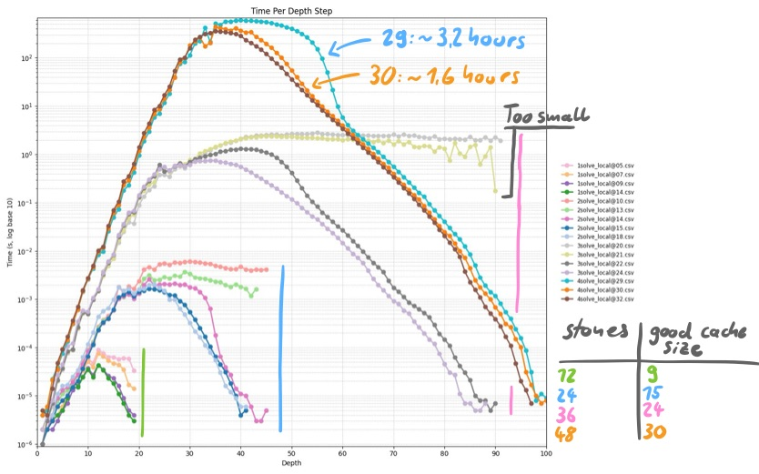

## CMancala

### Overview

CMancala is a powerful Mancala solver and analyzer.
While it's not the project’s primary focus, you can play against (effectively unbeatable) AI agents.

### Rules

The game follows basic Mancala rules.
An **Avalanche** mode is also available.

### Interface (config/menu/playing)

CMancala starts in **config** mode to set game hyperparameters.
When you start the game you enter one of three modes. You can switch between them at any time:

* **Config:** Adjust application and game hyperparameters.
* **Menu:** Perform analytical operations on the current game.
* **Playing:** Play the game.

More info is available via `help`. It lists all legal commands in every mode.

### Performance

The AI runs on a single thread.
Performance varies with the game state and number of stones.

* It typically searches 20–30 moves in a 5-second thinking window.
* With 4 stones per pit, the AI reaches a very high level in about 60 seconds.
* Fewer stones per pit improve search speed.
* As the game progresses, the AI's move prediction improves.

In most configs, if the AI starts the game it becomes almost unbeatable.
(In the classic 4 stones per pit setup, the starting player has an evaluation advantage of 8 at the start.)

Cache size notes (**LOCAL**):

* Cache size is an exponent: size = `2^N`
* Memory usage: `2^N * 16 bytes`
* Default: **24** → ~268 MB RAM
* Too large is never a problem (only RAM)
* Use **29–32** for long solves (e.g. uniform 4-stone)

<p align="center">
  
</p>

*Measured on CMancala **v3.0***  

More measurements are in the `measurements` directory.

### Algorithm

All solvers use Negamax with Alpha-Beta pruning. They handle double moves. Common features:

* **Double move handling:** Search adjusts when the same player continues or turn switches.
* **Aspiration windows + iterative deepening:** Enables time-limited searches and better performance.
* **Clip:** Changes solver behavior to only search for winning or losing moves. Only useful when the AI is in a winning position. In losing positions it treats all moves as equally bad if it can't find a win. That often causes the agent to pick the first IDX move and not return to a winning position.

#### Solvers

* **GLOBAL:**
  Default reference solver.
  It completes only after exhaustively searching the game tree for the best move at the current node.

* **LOCAL:**
  Much faster in most cases.
  It incorporates a transposition table and should give equal or better results at the same search depth.
  It is not the default because the code is more complex and harder to validate, though in testing it is at least as strong as GLOBAL.
  Increase the cache size to ~28–30 for long calculations (e.g., solving the uniform 4-stone position).

### Restrictions

* Maximum supported stones on the board at any time: 224.

### User interface

* CMancala has a terminal UI.

### Building and Running

1. Install CMake.
2. Have a compatible C compiler.
3. In the project directory run:

   ```bash
   cd build
   cmake ..
   make
   ```
4. Run:

   ```bash
   ./Mancala
   ```

CMancala also supports PGO. An example build script is provided.

### Discoveries

* The uniform 4 stones per pit position is solved with **LOCAL**. The starting player wins by **8** points with perfect play. Best start move: **IDX: 3**.
* In the uniform 3 stones per pit game the starting player wins by **2** points with perfect play. Best start move: **IDX: 5**.

### License

CMancala is released under the MIT License. See the `LICENSE` file for details.
